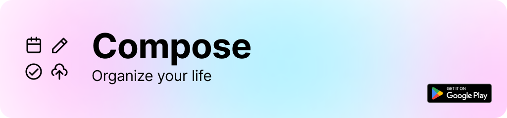
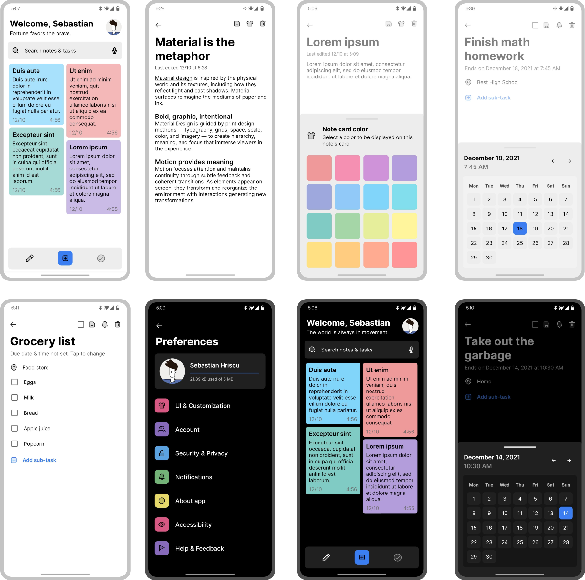

A simplistic android app to organize your notes, tasks and lists, which saves them to the cloud using Firebase and syncs across multiple devices through your Compose account. <a href="https://play.google.com/store/apps/details?id=com.compose.app.android">Get it on Google Play</a>
<br><br>


## License
```
Copyright (C) 2021  Sebastian Hriscu

This program is free software: you can redistribute it and/or modify
it under the terms of the GNU General Public License as published by
the Free Software Foundation, either version 3 of the License, or
any later version.

This program is distributed in the hope that it will be useful,
but WITHOUT ANY WARRANTY; without even the implied warranty of
MERCHANTABILITY or FITNESS FOR A PARTICULAR PURPOSE.  See the
GNU General Public License for more details.

You should have received a copy of the GNU General Public License
along with this program.  If not, see <https://www.gnu.org/licenses/>.
```
